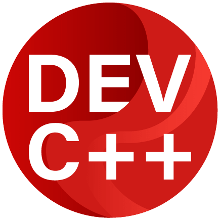

<h1 align="center">🎉 Proyecto Final - Despensa 🎉</h1>

    

> [!NOTE]  
> 📝 **"Despensa Simple"** es un sistema de gestión diseñado para pequeñas despensas y kioscos, facilitando el manejo de precios, inventarios y cuentas corrientes de forma sencilla y eficiente.

## 📚 Índice

- [Descripción del proyecto](#-descripción-del-proyecto)
- [Estado del proyecto](#-estado-del-proyecto)
- [Características del proyecto](#-características-del-proyecto)
- [Acceso al proyecto](#-acceso-al-proyecto)
- [Cómo ejecutar el proyecto](%EF%B8%8F-cómo-ejecutar-el-proyecto)
- [Tecnologías utilizadas](#-tecnologías-utilizadas)
- [Conclusión](#-conclusión)

## 📖 Descripción del proyecto

**Despensa El Tato** es una aplicación de escritorio pensada para ayudar a los propietarios de pequeños negocios a gestionar sus productos, controlar inventarios y realizar ventas de manera ágil y completamente gratuita. Entre sus funcionalidades destacan la búsqueda rápida de productos, la gestión de márgenes de ganancia, y el cálculo de vuelto.

Este proyecto está pensado para ser accesible a emprendedores que recién inician, con una interfaz intuitiva y opciones personalizables.

> [!TIP]  
> 💡 **¡El proyecto es totalmente local!** No necesita acceso a internet para funcionar.

## 🚧 Estado del proyecto

🔨 **Proyecto en desarrollo** 🔨

Actualmente, la aplicación está en su versión beta, con funcionalidad completa para cálculos de ganancias e inventario. Se planea añadir más funciones en versiones futuras, como reportes automáticos, extracción de datos, inventario local y gráficos de ventas.

## ⭐ Características del proyecto

- **Adicción de productos**: Añadir, eliminar y actualizar productos en el inventario virtual.
- **Búsqueda rápida**: Barra de búsqueda que permite encontrar productos rápidamente.
- **Cálculo de vuelto**: Automáticamente calcula el vuelto según el monto recibido.
- **Margen de ganancia personalizable**: Configura diferentes márgenes para calcular los precios de venta.

> [!WARNING]  
> ⚠️ El sistema no tiene función de base de datos local, código de barras ni acceso en línea.

## 🔗 Acceso al proyecto

Puedes acceder al código fuente del proyecto desde el siguiente enlace:

- [Repositorio GitHub](https://github.com/HugoAleOlguin/on_de_Despensas)

## 🛠️ Cómo ejecutar el proyecto

Para ejecutar el proyecto, sigue estos pasos:

1. Descarga el archivo 👉 [Releases](https://github.com/HugoAleOlguin/Gestion_de_Despensas/releases)
2. Abre el archivo `Despensa.simple.v2.1.cpp` en tu entorno de desarrollo C++ preferido.
3. Compila y ejecuta el código.

> [!IMPORTANT]  
> ⚠️ Asegúrate de tener un compilador C++ configurado en tu sistema.

## 🖥️ Tecnologías utilizadas

- **Lenguaje**: C++
- **Sistema Operativo**: Windows
- **IDE recomendado**: Dev-C++

    
    

## 💬 Conclusión

**"Despensa Simple"** es un proyecto pensado para simplificar la vida de los emprendedores, brindando una herramienta útil y fácil de usar. El objetivo es mejorar el sistema con nuevas funcionalidades conforme se adquieran más conocimientos.

> ✨ **Las mejoras futuras incluirán reportes detallados y más opciones de personalización!**
